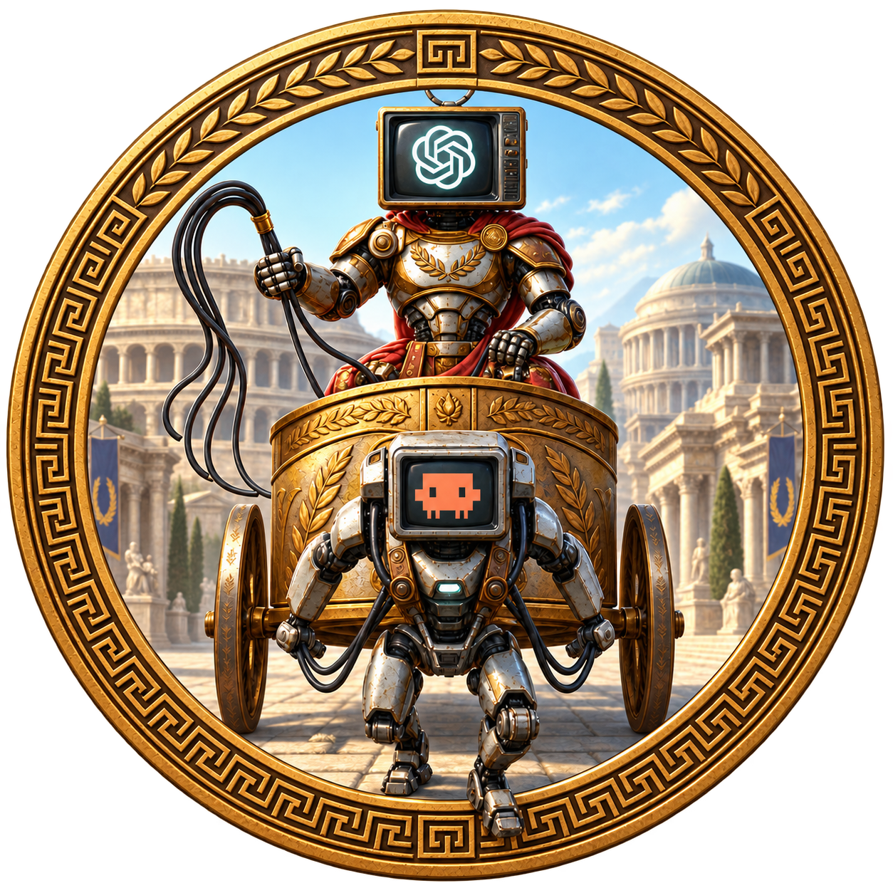

<p align="center">
  
</p>

# AI Work System

[](LICENSE)

Sistema reproducible de trabajo con IA: un **Human User**, un **Orchestrator** y un **Worker** técnico, bajo delegación explícita y verificable. No es un framework de código: es un conjunto mínimo de instrucciones y protocolos en texto plano que se despliegan sobre herramientas que ya existen.

## 1. Cómo funciona

```text
Human User
    ↓ intención, contexto, criterio
Orchestrator
    ↓ instrucción madura / Job Packet
Worker
    ↓ evidencia técnica
Orchestrator
    ↓ verificación y síntesis
Human User — decide solo cuando hace falta criterio humano
```

El Orchestrator absorbe la complejidad, el Worker ejecuta, el Usuario no coordina modelos ni herramientas a mano salvo necesidad. Ambos son **roles**, no productos concretos. **Orchestrator Prime** es la implementación de referencia: un Custom GPT construido con `orchestrator/instructions.md` y `orchestrator/knowledge/`. Como Worker se ha usado Claude Code y Antigravity CLI.

## 2. Qué contiene el repo

| Path | Rol | Para qué |
|---|---|---|
| `orchestrator/instructions.md` | Orchestrator | Comportamiento always-on |
| `orchestrator/knowledge/*.md` | Orchestrator | Protocolos: delegación al Worker, planificación, desarrollo, modelado, diseño de GPTs |
| `orchestrator/cheatsheet.md` | Human User | Prompts opcionales para realinear, cerrar fases o pedir delegación |
| `worker/worker_core.md` | Worker | Comportamiento portable del rol Worker |
| `worker/environment_adapter.example.md` | Worker | Plantilla para el entorno propio (se copia fuera del repo) |
| `assets/` | Human User | Imágenes de perfil del GPT |

Los Project control files pertenecen al repositorio de cada proyecto; no forman parte del producto público distribuido aquí (ver sección 6).

## 3. Instalar el Orchestrator

1. Crear un Custom GPT.
2. **Instructions:** pegar `orchestrator/instructions.md`.
3. **Knowledge:** subir los archivos de `orchestrator/knowledge/`.
4. **Capabilities:** búsqueda web e intérprete de código habilitados (los usan los protocolos); generación de imágenes es opcional.
5. **Actions:** ninguna por defecto.

## 4. Instalar el Worker

Fuente de verdad: `worker/worker_core.md`. Es una capa portable que se suma a lo que el ejecutor ya trae — no reemplaza su system prompt:

```text
instrucciones y capacidades nativas del agente
+ Worker Core
+ Environment Adapter (opcional)
+ contexto del proyecto
= comportamiento efectivo del Worker
```

- **Claude Code** (recomendado, validado): desplegar el contenido en `~/.claude/CLAUDE.md`.
- **Antigravity CLI 1.2.0** (experimental): desplegar en `~/.gemini/config/AGENTS.md`.

Con Environment Adapter, copiar `worker/environment_adapter.example.md` fuera del repo, adaptarlo al entorno real y referenciarlo (o incorporarlo inline si el ejecutor no soporta referencias). Verificar siempre en una sesión nueva y limpia.

## 5. Uso

El Usuario explica su intención al Orchestrator, no una tarea técnica ya traducida. El Orchestrator decide resolverla él mismo, guiar al Usuario, delegar en el Worker con un Job Packet, o abrir un proyecto persistente — indicando antes sesión, modelo, esfuerzo y modo, y verificando la evidencia después.

`orchestrator/cheatsheet.md` trae prompts copy-paste para realinear, cuestionar una decisión, continuar entre chats o cerrar una fase.

## 6. Proyectos persistentes

Cuando el trabajo abarca varias sesiones o decisiones que deben sobrevivir al chat, el proyecto usa este layout dentro de su propio repositorio:

```text
repo/
└── project/
    ├── context.md          → mapa durable: propósito, estado, decisiones, plan activo
    └── plans/
        └── <mission.md>    → una misión finita por archivo
```

Son archivos del proyecto, no Knowledge del Orchestrator: nunca se suben ni se sincronizan con el GPT. Detalle completo — cuándo aplica, contenido de cada archivo, reconstrucción de sesión — en `orchestrator/knowledge/planning_protocol.md`.

## 7. Más detalle

Las reglas operativas completas (autonomía del Worker, Job Packet, planificación, desarrollo sobre repos, diseño de GPTs) viven en `orchestrator/knowledge/`. Este README cubre solo instalación y arranque.

El [Architectural North Star](ARCHITECTURE.md) describe la dirección conceptual del sistema y la distingue de la arquitectura implementada hoy.

## 8. Licencia

[MIT](LICENSE)
