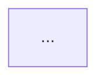
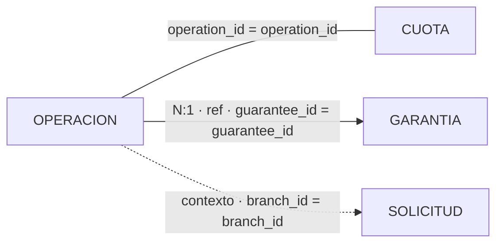

# Semantic Data Dictionary Protocol

> **Propósito:** transformar una base de datos desconocida o legacy en un mapa semántico navegable, verificable y mantenible por humanos y agentes.
>
> **Ámbito:** diseño, generación, enriquecimiento, validación, versionado y publicación de diccionarios de datos semánticos. Es agnóstico a motor, industria y arquitectura analítica.
>
> **Principio rector:** el diccionario no es un catálogo de columnas. Es una capa de comprensión del sistema fuente. La automatización mantiene estructura y evidencia; el humano sigue siendo dueño del conocimiento curado.

Este protocolo describe cómo construir un diccionario con cuatro capacidades simultáneas:

1. **orientación global** — un índice que permite recorrer el universo de datos;
2. **comprensión por objeto** — cada tabla explica qué es, qué representa una fila y cómo vive en el tiempo;
3. **comprensión técnica** — columnas, tipos, claves, códigos y descripciones siguen siendo SSOT técnico;
4. **conectividad** — relaciones explícitas y legibles sin convertir inferencias débiles en joins falsos.

No presupone DB2, GeneXus, Trino, Tableau, un lakehouse ni un stack concreto. Tampoco presupone que exista documentación previa de calidad.

---

# 1. Cuándo usar este protocolo

Usarlo cuando el problema observable sea alguno de estos:

- existe una base relevante pero su conocimiento está disperso entre código, SQL, expertos y nombres legacy;
- hay un diccionario técnico que enumera columnas pero no explica qué representan las tablas;
- humanos o agentes tardan demasiado en orientarse antes de un análisis, migración o modelado;
- una migración de DWH/lakehouse necesita comprender el sistema fuente antes de diseñar hechos y dimensiones;
- un equipo de ciencia de datos o BI necesita una capa semántica común antes de EDA, feature engineering o modelado;
- una consultoría recibe acceso a una base nueva y necesita convertirla rápidamente en un activo entendible y versionable.

No usarlo como excusa para:

- diseñar el modelo dimensional final;
- decidir Bronze/Silver/Gold;
- sustituir un catálogo de gobierno empresarial;
- documentar procesos que no tienen relación con los datos;
- crear una ontología exhaustiva antes de que exista una necesidad real.

El diccionario describe primero **el sistema fuente tal como existe**.

---

# 2. Resultado esperado

El producto mínimo tiene tres niveles.

```text
README.md
→ mapa semántico del universo

dictionary/<...>/<objeto>.md
→ conocimiento de cada tabla

docs/data_dictionary_guide.md
→ única guía para interpretar el sistema
```

Los detalles físicos de carpetas pueden reflejar schema, prefijo, dominio u organización existente. No mover archivos sólo para que la taxonomía semántica “se vea más elegante”. La semántica vive en el contenido y en el índice, no en una reorganización cosmética del árbol.

## 2.1 README — mapa, no inventario

El README es una **vista derivada y regenerable**.

Su función es responder rápidamente:

- ¿qué objetos existen?;
- ¿qué rol cumplen?;
- ¿cómo viven en el tiempo?;
- ¿qué patrón analítico podrían soportar?;
- ¿qué representa una fila?;
- ¿qué tabla debería abrir ahora?

Agrupar por **Rol de datos**.

Columnas recomendadas:

| Objeto | Tipo | Patrón temporal | Perfil analítico | Grano | Descripción funcional | Enlace |
|---|---|---|---|---|---|---|

No convertir el README en una segunda fuente de verdad. Su SSOT son las páginas de cada objeto.

Los apéndices o documentos transversales, si existen, viven en una sección independiente del README. Por defecto no se inyectan links a ellos dentro de cada tabla.

## 2.2 Página de tabla — contrato canónico

```markdown
[Volver al Índice](...)

# Tabla: `nombre`

> **Esquema:** ... | **Agrupación:** ... | **Última extracción:** ... | **Tipo:** ... | **Estado documental:** Curado

## 1. Perfil Semántico

- **Descripción funcional:** ...
- **Rol de datos:** ...
- **Patrón temporal:** ...
- **Perfil de modelado analítico:** ...
- **Grano:** ...

## 2. Estructura Técnica (SSOT)

| Columna | Tipo de Dato | PK | Descripción |
| ... |

## 3. Diagrama de Relaciones


```

No mantener una sección legacy paralela de “Reglas de Negocio” si sólo repite una descripción funcional inferior. Una sola capa semántica autoritativa es preferible a dos explicaciones que puedan divergir.

## 2.3 Guía única

`docs/data_dictionary_guide.md` debe ser la única SSOT interpretativa.

Debe explicar como mínimo:

- propósito del diccionario;
- anatomía de una página;
- Perfil Semántico;
- Estado documental;
- estructura técnica;
- convención ID = descripción;
- relaciones Mermaid;
- cardinalidad;
- incertidumbre;
- diferencia entre sistema fuente y candidato analítico.

No crear cheatsheets redundantes si la guía ya cubre el tema.

---

# 3. Owners de la información

Un conocimiento debe tener un solo dueño.

| Información | Owner |
|---|---|
| semántica de una tabla | página `.md` de la tabla |
| columnas, tipos, PK, descripciones técnicas | Estructura Técnica |
| códigos/IDs interpretados | descripción del campo o referencia explícita |
| relaciones publicadas | Mermaid de la tabla |
| explicación del estándar | `data_dictionary_guide.md` |
| navegación global | README derivado |
| estado mutable de una misión de implementación | Project plan/context del proyecto |
| reglas de delegación | `worker_protocol.md` |
| reglas de desarrollo | `development_protocol.md` |

No duplicar conocimiento estable en varios artifacts “por comodidad”.

---

# 4. Perfil Semántico

El Perfil Semántico responde cinco preguntas diferentes. No mezclar los ejes.

## 4.1 Descripción funcional — ¿qué representa y para qué sirve?

Máximo recomendado: 2–3 frases.

Debe explicar:

- qué realidad del negocio representa;
- para qué se usa principalmente;
- una limitación material si existe.

Debe poder leerse sin conocer los nombres físicos de todas las columnas.

Evitar:

> “Tabla Maestra de Operaciones.”

Preferir:

> “Concentra el estado vigente y acumulado de cada operación de crédito, incluyendo saldos, mora y atributos del producto. La misma fila evoluciona durante distintos hitos del ciclo de vida.”

Una descripción funcional puede citar otras tablas cuando sea necesario para explicar una limitación real, pero no debe convertirse en un mini-manual del sistema.

## 4.2 Rol de datos — ¿qué clase de cosa es?

Vocabulario canónico:

- **Entidad**
- **Referencia**
- **Evento / Transacción**
- **Asociación**
- **Control / Configuración**
- **Derivado / Resumen**
- **No determinado**

### Entidad

Objeto persistente e identificable del negocio.

Ejemplos abstractos: cliente, contrato, operación, cuota, solicitud.

### Referencia

Datos que describen dominios, códigos, catálogos, clasificaciones o lookups.

La presencia de pocos registros o códigos numéricos no basta por sí sola; debe cumplir una función de referencia.

### Evento / Transacción

Hecho ocurrido en un momento o período: pago, llamada, rechazo, desembolso, venta, movimiento.

### Asociación

La tabla existe principalmente para materializar una relación entre entidades.

No forzar este rol por el simple hecho de que una tabla tenga varias FKs.

### Control / Configuración

Parámetros, control operativo, estado de procesos técnicos, calendarios de ejecución, configuración.

### Derivado / Resumen

Dataset calculado, consolidado o agregado que crea una nueva representación.

**Una copia o snapshot al mismo grano no es automáticamente Derivado / Resumen.**

### No determinado

La evidencia disponible no permite clasificar responsablemente.

`No determinado` es conocimiento explícito sobre una deuda de comprensión; no es un error del diccionario.

---

# 5. Patrón temporal

Responde: **¿cómo vive esta tabla en el tiempo?**

Vocabulario:

- **Estado actual**
- **Eventos acumulativos**
- **Snapshot periódico**
- **Snapshot acumulativo**
- **Histórico versionado**
- **Mixto**
- **No determinado**

## 5.1 Estado actual

La fila representa principalmente la condición vigente. Cambios anteriores no quedan representados como versiones o hitos acumulados.

## 5.2 Eventos acumulativos

Cada hecho nuevo agrega una fila. El histórico surge naturalmente por append.

## 5.3 Snapshot periódico

Cada período produce una fotografía del estado a ese momento.

Ejemplos abstractos: cierre diario, foto mensual, cartera al fin de período.

## 5.4 Snapshot acumulativo

Una fila representa un proceso o entidad y se actualiza a través de hitos sucesivos.

Es distinto de un simple “estado actual” cuando la fila actúa como acumulador del ciclo de vida y sus fechas/estados reflejan hitos del proceso.

## 5.5 Histórico versionado

Múltiples versiones de la misma entidad se conservan explícitamente.

## 5.6 Mixto

Sólo cuando el objeto realmente combina comportamientos temporales que no pueden expresarse honestamente con una sola categoría.

No usar `Mixto` para evitar investigar.

---

# 6. Perfil de modelado analítico

Responde:

> **¿A qué patrón analítico puede mapear razonablemente el grano ACTUAL de esta fuente de forma directa?**

Vocabulario canónico:

- **Dimension Candidate**
- **Transaction Fact Candidate**
- **Periodic Snapshot Fact Candidate**
- **Accumulating Snapshot Fact Candidate**
- **Bridge Candidate**
- **Aggregate Fact Candidate**
- **Factless Fact Candidate**
- **No Direct Analytic Mapping**
- **Unknown**

Puede ser multietiqueta sólo cuando el **mismo grano actual** lo justifique.

No incluir patrones que exigirían:

- cambiar materialmente el grano;
- fabricar nuevos eventos;
- agregar la tabla;
- reconstruir un histórico que no existe;
- hacer una transformación sustancial.

## 6.1 Exclusividad

`Unknown` debe aparecer solo.

`No Direct Analytic Mapping` debe aparecer solo.

Ninguno puede coexistir con un `* Candidate`.

## 6.2 Coherencias esperables

Son señales de revisión, no reglas mecánicas:

| Patrón temporal | Perfil normalmente compatible |
|---|---|
| Eventos acumulativos | Transaction Fact Candidate |
| Snapshot periódico | Periodic Snapshot Fact Candidate |
| Snapshot acumulativo | Accumulating Snapshot Fact Candidate |
| Asociación | Bridge Candidate |
| derivado con nuevo grano agregado | Aggregate Fact Candidate |

Una discrepancia exige volver a la evidencia, no autocorregir por tabla de mapping.

## 6.3 Sistema fuente ≠ modelo analítico

`Dimension Candidate` no significa que la tabla fuente ya sea una dimensión final.

`Transaction Fact Candidate` no significa que pueda copiarse sin modelado.

Y esta clasificación no es Bronze/Silver/Gold. La medallion architecture describe etapas del lakehouse; este campo describe la posible forma analítica del **source grain**.

---

# 7. Grano

Responde:

> **¿Qué representa exactamente una fila?**

Formato recomendado:

> “Una fila representa ...”

Derivarlo de:

1. PK/unique constraints;
2. identidad documentada;
3. nombres y uso de campos;
4. relaciones;
5. comportamiento observado en código/SQL;
6. evidencia del negocio.

No inventar precisión para que la frase “suene completa”.

Si la evidencia no alcanza:

> **No determinado con la evidencia disponible.**

El grano es uno de los campos más importantes del diccionario. Sin él es fácil interpretar mal joins, cardinalidades y candidatos analíticos.

---

# 8. Estado documental

El Estado documental es deliberadamente **separado** del Perfil Semántico.

Vocabulario mínimo:

- **Curado**
- **Pendiente**

## 8.1 Curado

La tabla fue aceptada editorialmente como suficientemente conocida para confiar en ella a nivel tabla.

No significa:

- que los datos sean correctos;
- que cada descripción de campo sea completa;
- que la tabla sea importante;
- que tenga mejor calidad;
- que pertenezca a un rol concreto.

Es una señal de **confianza documental/editorial**.

## 8.2 Pendiente

Todavía no existe esa garantía editorial a nivel tabla.

El sistema puede seguir usando evidencia a granularidad más fina.

## 8.3 Regla de generación

Página nueva:

> `Estado documental: Pendiente`

Página existente:

> preservar el valor curado manualmente.

Una actualización técnica nunca debe promover automáticamente `Pendiente → Curado`.

---

# 9. Estructura Técnica como SSOT

La tabla de columnas debe conservar lo que el sistema físico sabe y lo que los humanos han enriquecido.

Campos mínimos:

- nombre;
- tipo;
- PK;
- descripción.

Puede incluir más metadata si aporta valor real, pero no convertir la página en un dump indiscriminado del catálogo del motor.

## 9.1 Dominios codificados

Cuando un campo contiene IDs/códigos conocidos, la descripción puede incluir sus equivalencias de forma vertical y legible:

```text
ID Estado

1 = ...
2 = ...
7 = ...
```

Esto es útil simultáneamente para humanos y agentes.

Si existe una tabla de Referencia formal:

```text
campo
→ referencia
→ catálogo/reference table
```

La tabla de referencia es el SSOT semántico. El listado embebido sigue siendo una vista conveniente cuando agrega valor.

No duplicar manualmente catálogos gigantes en múltiples sitios si existe un owner claro.

---

# 10. Evidencia

Toda clasificación o relación que afecte decisiones debe poder rastrearse a evidencia.

Fuentes típicas:

- catálogo del DBMS;
- constraints;
- queries reales;
- SQL embebido en aplicaciones;
- código de escritura/lectura;
- procedimientos almacenados;
- pipelines;
- documentación existente;
- conocimiento curado de expertos;
- comportamiento observado.

Separar explícitamente:

- **Hecho comprobado**
- **Inferencia**
- **Suposición**
- **Recomendación**

## 10.1 Evidencia técnica no equivale automáticamente a semántica

Ejemplos:

- mismo nombre de columna ≠ relación;
- copia de un valor ≠ FK;
- lineage ≠ join;
- coexistencia en la misma query ≠ identidad;
- camino A→B→C ≠ relación directa A→C;
- coincidencia de fechas ≠ clave.

La evidencia automática debe demostrar la propiedad que se quiere publicar.

## 10.2 Confianza interna

Durante reconnaissance puede usarse `HIGH / MEDIUM / LOW` u otro esquema interno.

No es obligatorio publicarlo.

Regla segura:

- evidencia suficiente → publicar;
- evidencia débil → `No determinado` / `Unknown`;
- nunca “rellenar” el diccionario para alcanzar 100% de clasificación.

---

# 11. Relaciones

El diagrama debe mostrar **conexiones útiles y defendibles**, no todas las correlaciones posibles.

Taxonomía recomendada:

- **ENTITY_KEY**
- **REFERENCE**
- **CONTEXT**
- **VALUE_PROPAGATION**

## 11.1 ENTITY_KEY

Conecta instancias concretas de entidades/procesos.

Ejemplo abstracto:

```text
Operación.operation_id
↔
Cuota.operation_id
```

## 11.2 REFERENCE

Una entidad o evento referencia un catálogo/master/reference.

Visualmente debe indicar `ref`.

## 11.3 CONTEXT

Las tablas comparten un contexto demostrado, pero el campo no identifica por sí solo una fila relacionada.

Ejemplos: misma sucursal, cuenta, fecha de proceso o canal en dos tablas operativas.

Debe verse distinto de una relación de identidad.

## 11.4 VALUE_PROPAGATION

Un valor fue copiado, calculado o propagado.

Por defecto **no se renderiza como relación Mermaid**.

Una fecha copiada a otra tabla no transforma esa fecha en una clave de join.

---

# 12. Evidencia de relaciones

Fuentes de evidencia útiles:

- **CURATED** — relación agregada por un humano con conocimiento válido;
- **SQL_JOIN** — predicado de join explícito y reconstruido correctamente;
- **READ_THEN_INSERT** — una clave se lee de un objeto y se escribe en otro;
- **SHARED_GENERATION** — el mismo identificador generado se asigna a ambos objetos sin reasignación;
- constraints/FKs reales cuando existan.

## 12.1 Reglas duras

1. **No fusionar predicados de instancias de evidencia independientes** para inventar un join compuesto.
2. **No inferir transitividad** como relación directa.
3. **No convertir VALUE_PROPAGATION en ENTITY_KEY.**
4. **No inventar cardinalidad.**
5. **No borrar una relación curada válida porque no exista evidencia automática.**
6. **No preservar silenciosamente una relación manual mecánicamente imposible.**

Si una relación curada referencia una columna inexistente:

> reportar `INVALID_CURATED`, excluirla del render y proponer la corrección.

---

# 13. Mermaid

Convención visual recomendada:



Lectura:

- línea sólida sin `ref` → identidad/entidad;
- flecha con `ref` → referencia;
- línea punteada `contexto` → contexto compartido;
- cardinalidad sólo cuando esté demostrada.

Ausencia de cardinalidad significa:

> no está suficientemente demostrada.

No significa error.

## 13.1 Provenance automática invisible

Si existe generador automático, la provenance no debe contaminar el label visible.

Patrón robusto:

```text
%% AUTO sha256=<fingerprint>
<edge Mermaid>
```

El fingerprint representa de forma determinista la arista generada.

Al releer:

- marker válido + fingerprint coincide → AUTO;
- marker existe pero la arista fue editada → CURATED;
- sin marker → CURATED.

Consecuencia:

> **editar manualmente una arista automática toma ownership humano automáticamente.**

No exigir que el humano conozca la implementación interna.

## 13.2 Supresión

Una relación CONTEXT automática puede ocultarse si el mismo par de tablas ya tiene una relación más fuerte y el contexto no agrega información útil.

Una relación CURATED no debe suprimirse silenciosamente por esa regla.

---

# 14. Precedencia del conocimiento

Invariante:

```text
curación humana válida
        ↓
máxima prioridad de ownership

evidencia automática demostrada
        ↓
completa / corrobora

inferencia automática permitida
        ↓
sólo con evidencia suficiente

sin evidencia
        ↓
No determinado / Unknown
```

“Manual gana” no significa que un error manual sea incuestionable.

La regla correcta es:

> **manual tiene prioridad de ownership; una contradicción mecánicamente comprobable debe señalarse.**

---

# 15. Automatización segura

Separar artifacts fuente de artifacts derivados.

```text
dictionary/**/*.md
→ conocimiento fuente editable

README.md
→ vista derivada regenerable

Mermaid
→ mezcla de CURATED + AUTO con ownership explícito

metadata DBMS
→ actualización técnica controlada
```

## 15.1 Generador de páginas

Para páginas existentes:

- preservar Perfil Semántico;
- preservar Estado documental;
- preservar descripciones manuales;
- preservar dominios ID=Descripción;
- preservar Mermaid;
- actualizar sólo la porción técnica de la que realmente es owner.

Para páginas nuevas:

- crear estructura canónica;
- `Estado documental: Pendiente`;
- semántica desconocida/no determinada como default seguro;
- nunca inventar descripción funcional.

## 15.2 Generador de README

Puede regenerarse completamente.

Debe ser:

- determinista;
- idempotente;
- link-safe.

## 15.3 Generador de relaciones

Debe soportar:

- dry-run sin writes;
- apply;
- segunda corrida con 0 cambios;
- CURATED durable incluso después de commit;
- invalid-curated detection;
- provenance invisible.

## 15.4 Post-commit durability

No considerar una preservación “probada” si sólo funciona mientras `HEAD` sigue apuntando al baseline anterior.

Probar explícitamente en una copia temporal:

1. commit del candidato;
2. correr generadores;
3. agregar una curación manual;
4. volver a correr;
5. confirmar que sobrevive;
6. editar una arista AUTO;
7. confirmar que toma ownership;
8. segunda corrida → 0 diff.

---

# 16. Workflow de construcción

El trabajo se ejecuta en fases finitas.

## Fase 0 — Definir boundaries

Antes de extraer nada:

- qué schemas/bases entran;
- qué objetos cuentan;
- qué paths son DEV/PRIVATE/PUBLIC;
- qué fuentes pueden leerse;
- qué consultas están permitidas;
- qué consumidores downstream existen;
- qué información no puede publicarse.

No asumir que “diccionario” significa automáticamente “publicable”.

## Fase 1 — Inventario técnico

Obtener:

- objetos;
- tipo;
- schema;
- columnas;
- tipos;
- PK/unique;
- remarks/comments;
- fecha de extracción.

Resultado:

> universo exacto de objetos que debe documentarse.

## Fase 2 — Baseline documental

Inspeccionar lo ya existente.

Medir:

- descripciones presentes;
- páginas existentes;
- categorías legacy;
- reglas duplicadas;
- catálogos embebidos;
- relaciones actuales;
- apéndices;
- consumidores downstream.

No borrar legacy todavía. Primero entender qué función estaba cumpliendo.

## Fase 3 — Reconnaissance semántica

Para cada objeto proponer:

- Descripción funcional;
- Rol;
- Patrón temporal;
- Perfil analítico;
- Grano.

Usar evidencia técnica y documental existente.

Publicar `No determinado` cuando corresponda.

No convertir esta fase en una investigación infinita: el objetivo es una clasificación defendible, no omnisciencia.

## Fase 4 — Reconnaissance de relaciones

Buscar evidencia de:

- joins explícitos;
- propagación de IDs;
- inserts derivados de reads;
- claves generadas compartidas;
- relaciones curadas existentes;
- FKs reales.

Clasificar cada evidencia antes de renderizarla.

## Fase 5 — Candidate

Construir el candidate en sandbox/branch.

No tocar el sistema productivo.

Generar:

- 100% de páginas;
- README;
- guía;
- relaciones.

Mantener legacy únicamente como input de migración cuando todavía sea necesario.

## Fase 6 — Coherence gate

Validar internamente:

- roles válidos;
- temporal válido;
- perfil válido;
- exclusividad `Unknown` / `No Direct`;
- temporal ↔ profile razonable;
- role ↔ profile razonable;
- grain ↔ profile razonable.

Revisar casos representativos y contradicciones.

## Fase 7 — Durability gate

Demostrar:

- curación manual sobrevive;
- post-commit idempotence;
- auto editado → curated;
- inválidos no se publican;
- generators no dependen accidentalmente del baseline Git anterior.

## Fase 8 — Human review

El usuario debe leer el producto como producto.

Abrir al menos:

- README;
- una Entidad;
- una Referencia;
- un Evento;
- un Snapshot;
- un No determinado;
- la guía.

Pregunta central:

> **¿Puedo entender rápidamente qué representa la tabla, qué significa una fila, cómo vive en el tiempo, cómo podría modelarse y con qué se conecta?**

No adoptar por passing tests si el producto sigue siendo difícil de leer.

## Fase 9 — Adopción DEV

Preservar baseline anterior con Git.

Patrón:

```text
tag v1
→ branch v2
→ tests
→ human gate
→ commit
→ push/MR
→ main
```

No usar carpetas manuales como `old_v1_final`.

En repos compartidos no hacer force-reset de `main` para rollback; preferir `git revert`.

## Fase 10 — Downstream compatibility

Antes de publicar:

- buscar consumidores que parsean headings;
- buscar campos legacy usados como lógica;
- buscar regex duplicadas;
- buscar filtros SQL sobre metadata que va a desaparecer;
- probar el consumidor contra el candidate real.

Una metadata aparentemente “cosmética” puede estar actuando como proxy funcional.

No publicar hasta entender esas dependencias.

## Fase 11 — Publicación

Si existe repo PUBLIC:

1. registrar SHA actual;
2. crear tag pre-major-version;
3. verificar sanitización;
4. ejecutar preflight sin sync;
5. comprobar schema drift;
6. publicar;
7. verificar PUBLIC real;
8. probar consumidores contra PUBLIC real;
9. verificar rollback reproducible.

No dar por terminado el rollout sólo porque DEV funciona.

---

# 17. Versionado y distribución

Para cambios mayores:

```text
DEV
v1 ──tag──► baseline
 │
 └────────► v2 actual

PUBLIC
v1 ──tag──► release histórica sanitizada
 │
 └────────► v2 actual
```

Esto permite:

- mantener `main` con la versión vigente;
- entregar una versión histórica cuando sea necesario;
- reproducir el estado anterior;
- hacer rollback sin copias manuales.

La entrega externa debe salir de un artifact explícitamente sanitizado, no de un tag de DEV que pueda contener material privado.

---

# 18. Publicación y seguridad

Antes de sincronizar a PUBLIC verificar:

- paths que se copian;
- paths que se borran;
- commit/push que ejecuta el pipeline;
- remote/branch destino;
- que README y guía sí se publiquen;
- que no se copien `references/`, `project/`, `.env`, credenciales, logs, scratch o artefacts internos.

Git protege archivos versionados; no protege side effects externos.

Por eso:

> **el pipeline de publicación requiere un gate distinto del merge DEV.**

---

# 19. Cambios manuales cotidianos

Flujo recomendado:

```text
editar páginas en DEV
→ git diff
→ revisión
→ commit/push DEV
→ ejecutar pipeline
→ smoke PUBLIC
```

No editar manualmente el README si es derivado.

No ejecutar publicación desde un working tree con cambios desconocidos.

Una mejora manual a Descripción funcional, Grano, Estado documental, IDs o relaciones curadas debe sobrevivir futuras corridas.

---

# 20. Anti-patterns

## 20.1 Taxonomía unidimensional que mezcla conceptos

Ejemplo abstracto:

```text
Maestra / Bitácora / Catálogo / Transaccional
```

puede mezclar:

- rol;
- temporalidad;
- patrón de escritura;
- madurez documental.

Separar ejes.

## 20.2 Legacy conservado “por si acaso”

Si una sección ya no aporta conocimiento único y una nueva capa la supera, eliminarla después de auditar que no contiene señal única.

No mantener documentación duplicada como monumento histórico.

## 20.3 Semántica para satisfacer al consumidor

No meter una categoría en el diccionario sólo porque un downstream la usa como proxy.

Primero identificar la propiedad real que necesita el consumidor.

Ejemplo general:

```text
taxonomía semántica
≠
confianza editorial
```

## 20.4 Lineage usado como join

Copiar un valor no demuestra que deba usarse para relacionar filas.

## 20.5 Cardinalidad inventada

Si no está demostrada, omitirla.

## 20.6 Unknown tratado como fracaso

Forzar una clasificación para alcanzar cobertura 100% destruye confianza.

## 20.7 Transitive graph fantasy

A→B y B→C no autorizan publicar A→C.

## 20.8 Modelo analítico confundido con source semantics

No llamar “fact” a una tabla sólo porque contiene números.

## 20.9 Overengineering del ownership

Preferir provenance invisible dentro del artifact antes que introducir sidecars/configs si no son necesarios.

## 20.10 Reorganizar paths sin valor

Mover decenas de archivos para “limpiar” prefijos físicos puede crear links rotos y ruido sin mejorar comprensión.

## 20.11 Documentos auxiliares redundantes

Una guía única gana frente a tres cheatsheets con información solapada.

## 20.12 Publicar antes de probar consumidores

Un parser downstream puede depender de un heading que parecía decorativo.

---

# 21. Validation matrix

Antes de declarar DONE:

## Cobertura

- [ ] universo de objetos definido;
- [ ] todas las páginas técnicas presentes;
- [ ] exactamente un Perfil Semántico por objeto;
- [ ] vocabularios válidos;
- [ ] unknowns explícitos.

## Preservación

- [ ] descripciones manuales preservadas;
- [ ] ID=Descripción preservado;
- [ ] Estado documental preservado;
- [ ] relaciones CURATED preservadas;
- [ ] invalid-curated detectado.

## Relaciones

- [ ] no lineage-as-join;
- [ ] no transitive edges;
- [ ] no fake composite joins;
- [ ] cardinalidad sólo con evidencia;
- [ ] context diferenciado;
- [ ] provenance automática invisible.

## Automatización

- [ ] build determinista;
- [ ] README idempotente;
- [ ] ER dry-run = 0 writes;
- [ ] ER apply ×2 = 0 diff;
- [ ] durability post-commit probada.

## Navegación

- [ ] README sirve como mapa;
- [ ] links internos válidos;
- [ ] guía única;
- [ ] páginas legibles sin contexto externo.

## Seguridad

- [ ] branch/sandbox antes de adopción;
- [ ] baseline/tag recuperable;
- [ ] PUBLIC sanitizado;
- [ ] consumidores downstream probados;
- [ ] rollback definido;
- [ ] no force push requerido.

## Human gate

- [ ] una persona que conoce el dominio leyó casos representativos;
- [ ] el producto fue aprobado por comprensión, no sólo por tests.

---

# 22. Definition of Done

La misión de creación de un Semantic Data Dictionary termina cuando:

1. el universo está cubierto;
2. cada objeto tiene Perfil Semántico, Estructura Técnica y Relaciones;
3. la incertidumbre está expresada honestamente;
4. el índice permite navegar el sistema;
5. existe una única guía interpretativa;
6. la automatización no destruye curación humana;
7. los generadores son deterministas/idempotentes;
8. los consumidores downstream relevantes son compatibles;
9. la versión anterior es recuperable;
10. la release vigente fue verificada en el entorno real;
11. el usuario aprobó el producto;
12. el plan se cierra.

Ideas futuras no bloquean DONE.

---

# 23. Estrategia de ejecución para Orchestrator Prime

Este protocolo gobierna la **metodología**. La delegación técnica sigue perteneciendo a `worker_protocol.md`; desarrollo sobre repos a `development_protocol.md`; planificación persistente a `planning_protocol.md`.

El Orchestrator debe:

1. madurar objetivo y boundaries;
2. identificar evidencia disponible;
3. abrir una misión finita;
4. delegar reconnaissance antes de implementación cuando la taxonomía o el comportamiento real todavía sean inciertos;
5. acordar gates metodológicos con el Usuario;
6. implementar en sandbox/branch;
7. verificar globalmente;
8. exigir human review;
9. adoptar con Git y rollback;
10. cerrar.

No convertir el protocolo en una ceremonia rígida. Saltar una fase cuando ya existe evidencia equivalente.

---

# 24. Entregable reusable de consultoría

La capacidad que este protocolo busca producir es:

> **convertir una base desconocida en un mapa semántico defendible y navegable antes de construir análisis o modelos encima.**

Un entregable típico incluye:

```text
README.md
dictionary/
  ...
docs/
  data_dictionary_guide.md
scripts/
  extracción/generación segura, cuando aplique
Git history / release tags
```

La metodología agrega valor porque reduce el tiempo necesario para responder:

- qué tablas importan;
- qué representa cada una;
- cuál es su grano;
- qué histórico existe;
- qué códigos significan;
- cómo se conectan;
- qué se sabe con certeza;
- qué todavía no se sabe;
- qué objetos pueden alimentar naturalmente modelos analíticos.

No prometer automatización total. El valor diferencial es una combinación de:

```text
evidencia técnica
+
automatización
+
semántica
+
curación humana
+
versionado
```

---

# 25. Routing recomendado

Cuando el Usuario pida crear, reconstruir, auditar o evolucionar un diccionario de datos semántico, o convertir una base desconocida en un mapa navegable para humanos y agentes:

> consultar `semantic_data_dictionary_protocol.md`.

No crear un GPT separado mientras este Knowledge dentro de Orchestrator Prime resuelva suficientemente bien el problema.

---

# 26. Principios que no deben perderse

1. **Un diccionario útil explica, no sólo enumera.**
2. **Semántica, temporalidad, perfil analítico y confianza documental son ejes distintos.**
3. **El grano es primera clase.**
4. **Unknown es mejor que una certeza inventada.**
5. **Lineage no es join.**
6. **Una relación útil debe estar respaldada por evidencia.**
7. **Curated válido tiene prioridad de ownership.**
8. **Editar manualmente debe ser una operación segura.**
9. **Automatización sin durabilidad post-commit no está terminada.**
10. **El README es un mapa; las páginas son la fuente.**
11. **Una sola guía interpretativa es mejor que documentación redundante.**
12. **Un cambio DEV y una publicación PUBLIC son gates distintos.**
13. **Un consumidor downstream puede convertir metadata “cosmética” en contrato funcional.**
14. **Preservar versiones con Git es mejor que acumular copias manuales.**
15. **El producto termina cuando ayuda a una persona a comprender la base más rápido y de forma defendible.**
